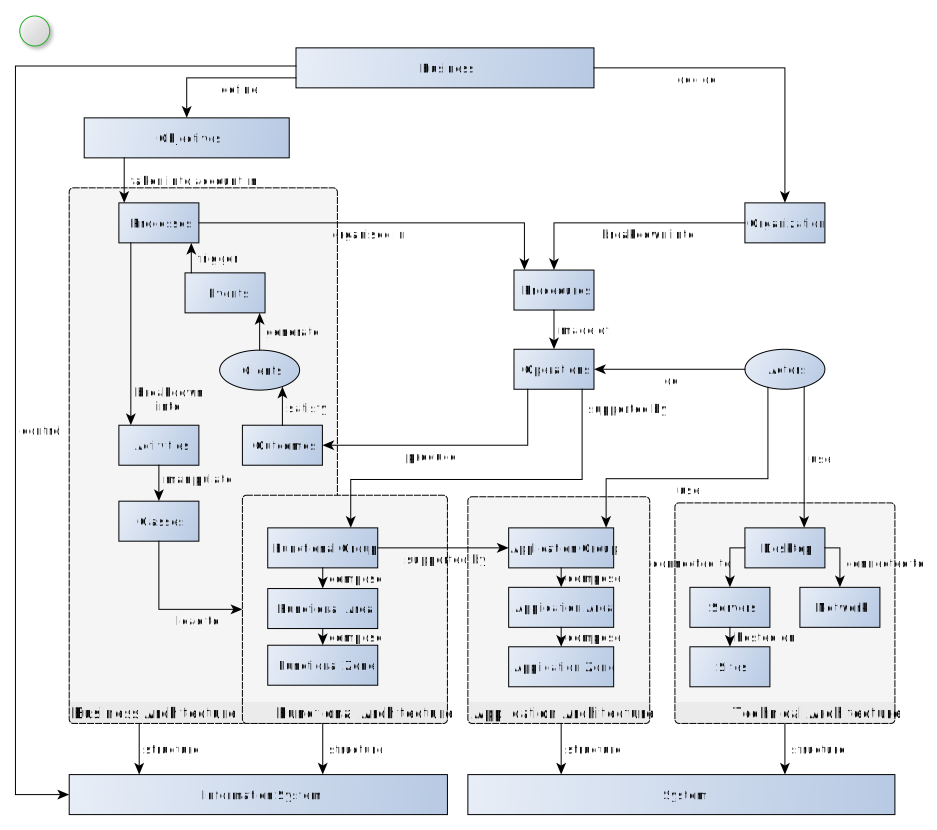

# EA Meta Model

Consider a complex diagram with multiple elements and imagine that we want to desribe all elements 
within a single page.
Following the [pyramid principle](/docs/Motivation.html#minto-pyramid-principle), it is important to
present each element and associated details while allowing the reader to attach the information to
the bigger picture and visualize where the information belongs.

We can achieve this by presenting a small map and highligting the current element; because the map is
just the initial diagram in reduced size, it is fully functional and allows navigation among the 
different elements; this again helps the reader to always attached the information to where it belongs,
even while jumping around in a lengthy page, going back an forth between elements.

## Business

## Objectives

## Organization

## Actors

## Procedures

## Operations

## Business Architecture

### Processes

### Events

### Clients

### Outcomes

### Activities

### Classes

## Functional Architecture

### Functional Group

### Functional Area

### Functional Zone

## Application Architecture

### Application Group

### Application Area

### Application Zone

## Technical Architecture

### Desktop

### Servers

### Sites

### Network

## Information System

## System
