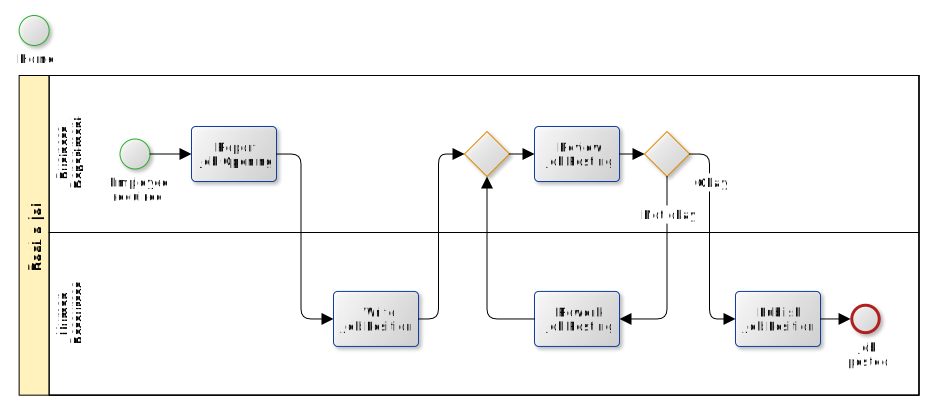

# Process

All relevant elements on the graph are hyperlinks that leads to the corresponding page.
When a page for a certain element is displayed, the corresponding element is highlighted. Note that
this is the same original svg graph being dynamically altered at injection time.    